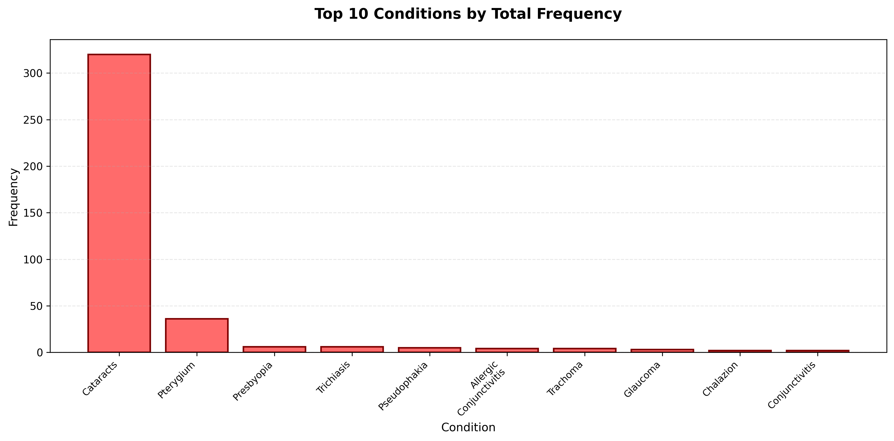
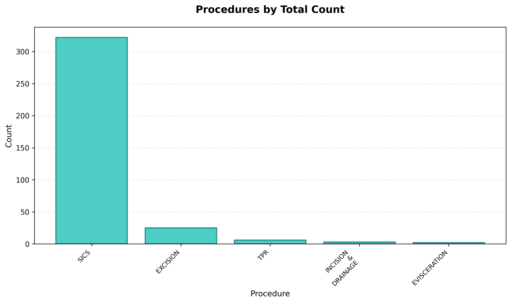
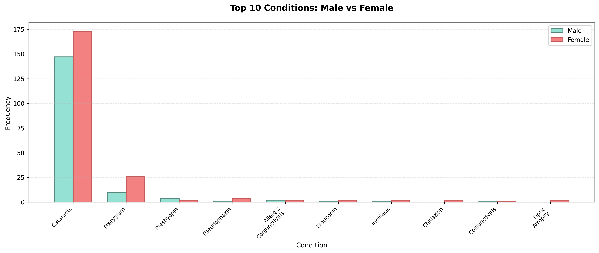

# Singida Eye Camp Report
## The Mo Dewji Foundation

---

## 1. Number of Procedures Done

**Total Procedures: 354**

**Gender Distribution:**
- Male: 153 (43.22%)
- Female: 201 (56.78%)

**Mean Age: 69.9 years**

---

## 2. Frequency Distribution of Conditions

### 2.1 General Frequency Distribution

**Note:** Condition counts are based on the operated eye for each patient. Since the Singida dataset has a single "Conditions" column (not separated by eye), conditions are assigned to the eye that was operated on. Some individuals had more than one diagnosis (e.g., "Cataracts, Pterygium"), and each condition is counted separately.

| Condition | Right Eye | Left Eye | Total |
|----------|-----------|----------|-------|
| Cataracts | 162 (83.08%) | 158 (77.45%) | 320 (79.01%) |
| Pterygium | 15 (7.69%) | 21 (10.29%) | 36 (8.89%) |
| Presbyopia | 0 (0.00%) | 6 (2.94%) | 6 (1.48%) |
| Trichiasis | 2 (1.03%) | 1 (0.49%) | 6 (1.48%) |
| Pseudophakia | 2 (1.03%) | 3 (1.47%) | 5 (1.23%) |
| Allergic Conjunctivitis | 2 (1.03%) | 2 (0.98%) | 4 (0.99%) |
| Trachoma | 2 (1.03%) | 0 (0.00%) | 4 (0.99%) |
| Glaucoma | 0 (0.00%) | 3 (1.47%) | 3 (0.74%) |
| Chalazion | 2 (1.03%) | 0 (0.00%) | 2 (0.49%) |
| Conjunctivitis | 1 (0.51%) | 1 (0.49%) | 2 (0.49%) |
| Dry Eye | 1 (0.51%) | 0 (0.00%) | 2 (0.49%) |
| Optic Atrophy | 1 (0.51%) | 1 (0.49%) | 2 (0.49%) |
| 'Pterygium'] | 0 (0.00%) | 1 (0.49%) | 1 (0.25%) |
| Bacterial Conjunctivitis | 0 (0.00%) | 1 (0.49%) | 1 (0.25%) |
| Cataracts' | 0 (0.00%) | 1 (0.49%) | 1 (0.25%) |
| Conj maa | 1 (0.51%) | 0 (0.00%) | 1 (0.25%) |
| Conjmass | 1 (0.51%) | 0 (0.00%) | 1 (0.25%) |
| Cyst | 0 (0.00%) | 1 (0.49%) | 1 (0.25%) |
| Diabetic Neuropathy | 1 (0.51%) | 0 (0.00%) | 1 (0.25%) |
| Diabetic Retinopathy | 1 (0.51%) | 0 (0.00%) | 1 (0.25%) |
| Endopthalmitis | 1 (0.51%) | 0 (0.00%) | 1 (0.25%) |
| Myopia | 0 (0.00%) | 1 (0.49%) | 1 (0.25%) |
| Optical Neuropathy | 0 (0.00%) | 1 (0.49%) | 1 (0.25%) |
| Photophobia | 0 (0.00%) | 1 (0.49%) | 1 (0.25%) |
| ['Allergic Conjunctivitis' | 0 (0.00%) | 1 (0.49%) | 1 (0.25%) |
| **Total** | **195 (100.00%)** | **204 (100.00%)** | **405 (100.00%)** |

#### Chart: Top 10 Conditions Distribution

### 2.2 Procedure Counts

| Procedure | Right Eye | Left Eye | Total |
|-----------|-----------|----------|-------|
| SICS | 161 (90.45%) | 161 (90.96%) | 322 (89.94%) |
| EXCISION | 12 (6.74%) | 13 (7.34%) | 25 (6.98%) |
| TPR | 2 (1.12%) | 1 (0.56%) | 6 (1.68%) |
| INCISION & DRAINAGE | 1 (0.56%) | 2 (1.13%) | 3 (0.84%) |
| EVISCERATION | 2 (1.12%) | 0 (0.00%) | 2 (0.56%) |
| **Total** | **178 (100.00%)** | **177 (100.00%)** | **358 (100.00%)** |

#### Chart: Procedures Distribution

---

## 3. Visual Acuity (VA) Analysis for Operated Eye

### 3.1 VA Distribution Across Time Points

| Visual Acuity | Pre-op | 1 Day Post-op | 2 Weeks Post-op | 1 Month Post-op | Change (Pre-op to 1 Month) |
|---------------|--------|---------------|-----------------|------------------|---------------------------|
| 6/6 | 8 (2.28%) | 18 (5.14%) | 84 (24.14%) | 245 (72.92%) | +2962.50% |
| 6/9 | 8 (2.28%) | 14 (4.00%) | 106 (30.46%) | 66 (19.64%) | +725.00% |
| 6/12 | 3 (0.85%) | 22 (6.29%) | 86 (24.71%) | 9 (2.68%) | +200.00% |
| 6/18 | 3 (0.85%) | 37 (10.57%) | 7 (2.01%) | 3 (0.89%) | +0.00% |
| 6/24 | 1 (0.28%) | 39 (11.14%) | 43 (12.36%) | 2 (0.60%) | +100.00% |
| 6/36 | 4 (1.14%) | 56 (16.00%) | 12 (3.45%) | 3 (0.89%) | -25.00% |
| 6/60 | 14 (3.99%) | 149 (42.57%) | 2 (0.57%) | 1 (0.30%) | -92.86% |
| CF1M | 44 (12.54%) | 0 (0.00%) | 0 (0.00%) | 0 (0.00%) | -100% |
| CF2M | 25 (7.12%) | 4 (1.14%) | 4 (1.15%) | 3 (0.89%) | -88.00% |
| CF3M | 16 (4.56%) | 0 (0.00%) | 0 (0.00%) | 0 (0.00%) | -100% |
| CF4M | 7 (1.99%) | 3 (0.86%) | 1 (0.29%) | 1 (0.30%) | -85.71% |
| CF5M | 10 (2.85%) | 2 (0.57%) | 0 (0.00%) | 0 (0.00%) | -100% |
| CFN | 36 (10.26%) | 0 (0.00%) | 0 (0.00%) | 0 (0.00%) | -100% |
| HM | 82 (23.36%) | 2 (0.57%) | 0 (0.00%) | 0 (0.00%) | -100% |
| PL | 87 (24.79%) | 2 (0.57%) | 1 (0.29%) | 1 (0.30%) | -98.85% |
| NPL | 3 (0.85%) | 0 (0.00%) | 0 (0.00%) | 0 (0.00%) | -100% |
| Q | 0 (0.00%) | 2 (0.57%) | 2 (0.57%) | 2 (0.60%) | +∞% |

**Total Patients with Pre-op VA: 351**
**Total Patients with 1 Day Post-op VA: 350**
**Total Patients with 2 Weeks Post-op VA: 348**
**Total Patients with 1 Month Post-op VA: 336**

### 3.2 Top 10 Patients with Highest Improvement

| Patient ID | Patient Name | Pre-op VA | 2 Weeks Post-op VA | 1 Month Post-op VA |
|------------|--------------|-----------|---------------------|---------------------|
| 070825-0882 | Fatuma nyuda | NPL | 6/12 | 6/6 |
| 090825-0631 | Andrea Munna | NPL | 6/6 | 6/6 |
| 070825-0019 | Juma maige | PL | 6/6 | 6/6 |
| 070825-0127 | Juma bakari | PL | 6/6 | 6/6 |
| 070825-0300 | Martha Damasi | PL | 6/6 | 6/6 |
| 070825-0154 | Fatuma Thabit | PL | 6/9 | 6/6 |
| 070825-0326 | Hawa Majengo | PL | 6/9 | 6/6 |
| 080825-0609 | Pendo said | PL | 6/6 | 6/6 |
| 070825-0915 | Leah bakari | PL | 6/9 | 6/6 |
| 080825-0702 | Isack Ikihalla | PL | 6/9 | 6/6 |

---

## 4. Conditions Analysis by Gender and Age

### 4.1 Frequency Distribution of Conditions by Gender

| Condition | Male - RE | Male - LE | Male - Total | Female - RE | Female - LE | Female - Total | Overall Total |
|-----------|-----------|-----------|--------------|-------------|-------------|----------------|---------------|
| Cataracts | 67 (93.06%) | 80 (80.00%) | 147 (85.47%) | 95 (77.24%) | 78 (75.00%) | 173 (76.21%) | 320 (80.20%) |
| Pterygium | 3 (4.17%) | 7 (7.00%) | 10 (5.81%) | 12 (9.76%) | 14 (13.46%) | 26 (11.45%) | 36 (9.02%) |
| Presbyopia | 0 (0.00%) | 4 (4.00%) | 4 (2.33%) | 0 (0.00%) | 2 (1.92%) | 2 (0.88%) | 6 (1.50%) |
| Pseudophakia | 1 (1.39%) | 0 (0.00%) | 1 (0.58%) | 1 (0.81%) | 3 (2.88%) | 4 (1.76%) | 5 (1.25%) |
| Allergic Conjunctivitis | 0 (0.00%) | 2 (2.00%) | 2 (1.16%) | 2 (1.63%) | 0 (0.00%) | 2 (0.88%) | 4 (1.00%) |
| Glaucoma | 0 (0.00%) | 1 (1.00%) | 1 (0.58%) | 0 (0.00%) | 2 (1.92%) | 2 (0.88%) | 3 (0.75%) |
| Trichiasis | 0 (0.00%) | 1 (1.00%) | 1 (0.58%) | 2 (1.63%) | 0 (0.00%) | 2 (0.88%) | 3 (0.75%) |
| Chalazion | 0 (0.00%) | 0 (0.00%) | 0 (0.00%) | 2 (1.63%) | 0 (0.00%) | 2 (0.88%) | 2 (0.50%) |
| Conjunctivitis | 0 (0.00%) | 1 (1.00%) | 1 (0.58%) | 1 (0.81%) | 0 (0.00%) | 1 (0.44%) | 2 (0.50%) |
| Optic Atrophy | 0 (0.00%) | 0 (0.00%) | 0 (0.00%) | 1 (0.81%) | 1 (0.96%) | 2 (0.88%) | 2 (0.50%) |
| Trachoma | 0 (0.00%) | 0 (0.00%) | 0 (0.00%) | 2 (1.63%) | 0 (0.00%) | 2 (0.88%) | 2 (0.50%) |
| 'Pterygium'] | 0 (0.00%) | 1 (1.00%) | 1 (0.58%) | 0 (0.00%) | 0 (0.00%) | 0 (0.00%) | 1 (0.25%) |
| Bacterial Conjunctivitis | 0 (0.00%) | 0 (0.00%) | 0 (0.00%) | 0 (0.00%) | 1 (0.96%) | 1 (0.44%) | 1 (0.25%) |
| Cataracts' | 0 (0.00%) | 0 (0.00%) | 0 (0.00%) | 0 (0.00%) | 1 (0.96%) | 1 (0.44%) | 1 (0.25%) |
| Conj maa | 0 (0.00%) | 0 (0.00%) | 0 (0.00%) | 1 (0.81%) | 0 (0.00%) | 1 (0.44%) | 1 (0.25%) |
| Conjmass | 0 (0.00%) | 0 (0.00%) | 0 (0.00%) | 1 (0.81%) | 0 (0.00%) | 1 (0.44%) | 1 (0.25%) |
| Cyst | 0 (0.00%) | 0 (0.00%) | 0 (0.00%) | 0 (0.00%) | 1 (0.96%) | 1 (0.44%) | 1 (0.25%) |
| Diabetic Neuropathy | 0 (0.00%) | 0 (0.00%) | 0 (0.00%) | 1 (0.81%) | 0 (0.00%) | 1 (0.44%) | 1 (0.25%) |
| Diabetic Retinopathy | 0 (0.00%) | 0 (0.00%) | 0 (0.00%) | 1 (0.81%) | 0 (0.00%) | 1 (0.44%) | 1 (0.25%) |
| Dry Eye | 0 (0.00%) | 0 (0.00%) | 0 (0.00%) | 1 (0.81%) | 0 (0.00%) | 1 (0.44%) | 1 (0.25%) |
| Endopthalmitis | 1 (1.39%) | 0 (0.00%) | 1 (0.58%) | 0 (0.00%) | 0 (0.00%) | 0 (0.00%) | 1 (0.25%) |
| Myopia | 0 (0.00%) | 0 (0.00%) | 0 (0.00%) | 0 (0.00%) | 1 (0.96%) | 1 (0.44%) | 1 (0.25%) |
| Optical Neuropathy | 0 (0.00%) | 1 (1.00%) | 1 (0.58%) | 0 (0.00%) | 0 (0.00%) | 0 (0.00%) | 1 (0.25%) |
| Photophobia | 0 (0.00%) | 1 (1.00%) | 1 (0.58%) | 0 (0.00%) | 0 (0.00%) | 0 (0.00%) | 1 (0.25%) |
| ['Allergic Conjunctivitis' | 0 (0.00%) | 1 (1.00%) | 1 (0.58%) | 0 (0.00%) | 0 (0.00%) | 0 (0.00%) | 1 (0.25%) |
| **Total** | **72 (100.00%)** | **100 (100.00%)** | **172 (100.00%)** | **123 (100.00%)** | **104 (100.00%)** | **227 (100.00%)** | **399 (100.00%)** |

#### Chart: Top 10 Conditions by Gender Comparison

### 4.2 Frequency Distribution of Conditions by Age Groups

**Methodology:** Patients were categorized into four age groups based on their age at the time of the eye camp: 19-40 years (young adults), 41-60 years (middle-aged), 61-80 years (older adults), and 81+ years (elderly). Conditions were assigned to the operated eye for each patient, since the dataset has a single "Conditions" column. This allows for comparison of condition prevalence across different age demographics. The analysis includes all condition occurrences, meaning if a patient had multiple conditions (e.g., "Cataracts, Pterygium"), each condition was counted separately.

#### Chart: Top 10 Conditions by Age Group Comparison

